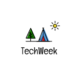

<h3 align="center">Tech Week!</h3>

</img>

  BFS식 공부법. 기술 면접을 위한 얕고 넓은 지식.

## Table of Contents
- [Web](#web)
- [Algorithm](#algorithm)
- [Computer Science](#computer-science)
- [Design Pattern](#desgin-pattern)
- [Language](#language)
- [ETC](#etc)

## Web
- [SPA](https://github.com/heeyeon-developer/STUDY_WEB/blob/master/2020.07.23_SPA.md)
- [Vue Cli? Webpack? 간단 개념](https://hceaan.tistory.com/41)
- [SSR과 CSR이란?](https://github.com/Haeeeun/TechWeek/blob/master/Web/SSR%EA%B3%BC%20CSR.md)
- [웹 페이지 렌더링 과정](https://blog.naver.com/dodi258/222038685105)
- [package.json](https://hceaan.tistory.com/42)
- [Angular Vue React 차이](https://github.com/heeyeon-developer/STUDY_WEB/blob/master/2020.08.03_Angular_React_Vue.md)
- [시맨틱하게 HTML짜기](https://hceaan.tistory.com/46)
- [URL (Uniform Resource Locator)](https://blog.naver.com/dodi258/222050170738)
- [Proxy(Proxy Server)는 무엇일까?](https://blog.naver.com/dodi258/222056878199)
- [앱과 웹사이트의 차이점](https://github.com/heeyeon-developer/STUDY_WEB/blob/master/2020.08.12_%EC%95%B1%EA%B3%BC%20%EC%9B%B9%EC%82%AC%EC%9D%B4%ED%8A%B8%EC%9D%98%20%EC%B0%A8%EC%9D%B4%EC%A0%90.md)
- [웹팩이란?](https://github.com/heeyeon-developer/STUDY_WEB/blob/master/2020.08.17_%EC%9B%B9%ED%8C%A9%EC%9D%B4%EB%9E%80.md)
- [Node.js](https://github.com/heeyeon-developer/STUDY_WEB/blob/master/2020.08.24_Nodejs%EB%9E%80.md)
- [CORS란?](https://github.com/heeyeon-developer/STUDY_WEB/blob/master/2020.09.14_CORS%EB%9E%80.md)
- [이벤트 버블링과 캡처링](https://hceaan.tistory.com/59?category=844766)

## Algorithm
- [DFS & BFS](https://github.com/heeyeon-developer/STUDY_WEB/blob/master/2020.08.31_DFS%26BFS.md)
- [정렬 알고리즘](https://n-square.tistory.com/61)

## Computer Science
- [용어 정리 - Framwork, Library, Module, Component, API](https://blog.naver.com/dodi258/222069825412)

## Desgin Pattern
- [MVC, MVP, MVVM](https://n-square.tistory.com/51)

## Language
- [Javascript 호출스택](https://hceaan.tistory.com/48)
- [C++과 Java의 차이점](https://n-square.tistory.com/33)
- [Javascript 모듈시스템](https://hceaan.tistory.com/56?category=844766)

## ETC
- 클라우드
- [REST API란?](https://github.com/Haeeeun/TechWeek/blob/master/Web/REST%20API.md)
- [Hadoop](https://github.com/heeyeon-developer/STUDY_WEB/blob/master/2020.07.16_Hadoop%EC%9D%B4%EB%9E%80.md)
- [SSO란?](https://n-square.tistory.com/46)
- [암호화 기법](https://n-square.tistory.com/66)

 

 주차별 정리 

#### 1주차 (2020. 07. 09)
- 희연 : SPA
- 승연 : REST API
- 해은 : Vue Cli? Webpack? 간단 개념
- 세인 : 클라우드

#### 2주차 (2020. 07. 22)
- 희연 : Hadoop
- 승연 : CSR과 SSR
- 해은 : package.json
- 세인 : 웹 페이지 렌더링 과정

#### 3주차 (2020. 08. 03)
- 희연 : Angular Vue React 차이
- 승연 : SSO이란?
- 해은 : 시맨틱하게 HTML짜기
- 세인 : URL (Uniform Resource Locator)

#### 4주차 (2020. 08. 10)
- 희연 : 앱과 웹사이트의 차이점
- 승연 : C++과 Java의 차이점
- 해은 : Javascript 호출스택
- 세인 : Proxy(Proxy Server)는 무엇일까?

#### 5주차 (2020. 08. 24)
- 희연 : Node.js
- 승연 : MVC, MVP, MVVM
- 해은 : Javascript 모듈시스템
- 세인 : 용어 정리 - Framwork, Library, Module, Component, API

#### 6주차 (2020. 08. 31)
- 희연 : DFS & BFS
- 승연 : 정렬 알고리즘
- 세인 : 비트 마스크(bit mask) - 비트 연산, 집합, 알고리즘 문제

#### 7주차 (2020. 09. 14)
- 희연 : CORS란?
- 승연 : 암호화 알고리즘
- 해은 : 이벤트 버블링과 캡처링

 

**Collaborator**

| |  |  |  |
| :-----------------------------------: | :---------------------------------------: | :-------------------------------------: | :-------------------------------------: |

 

**Since** : 2020.7.9 ~

